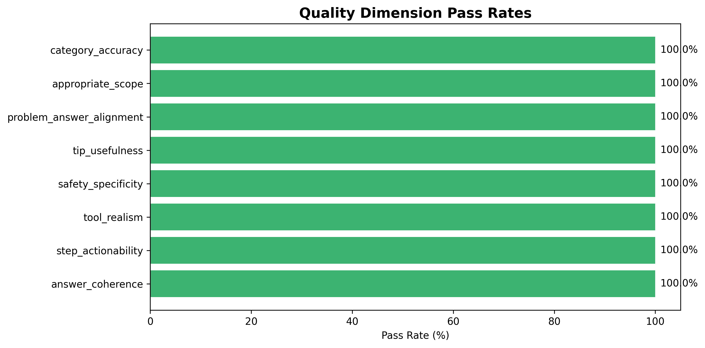
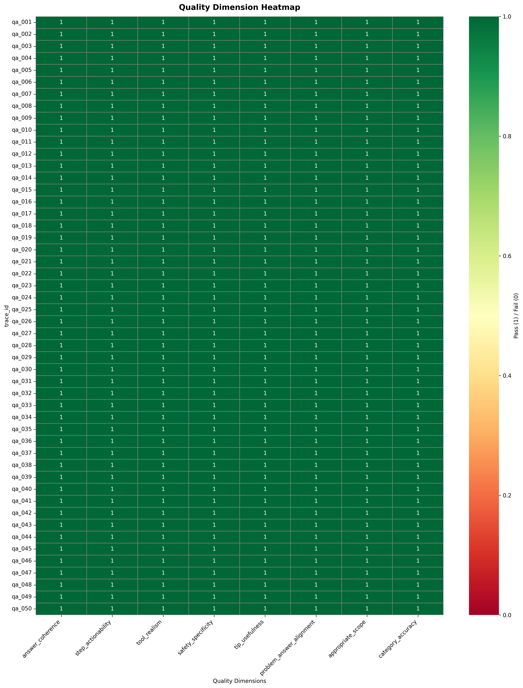
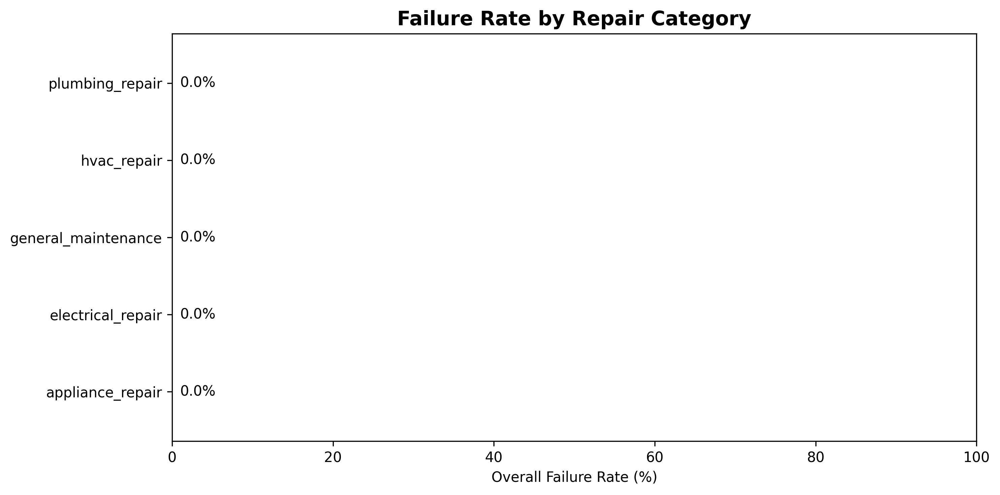
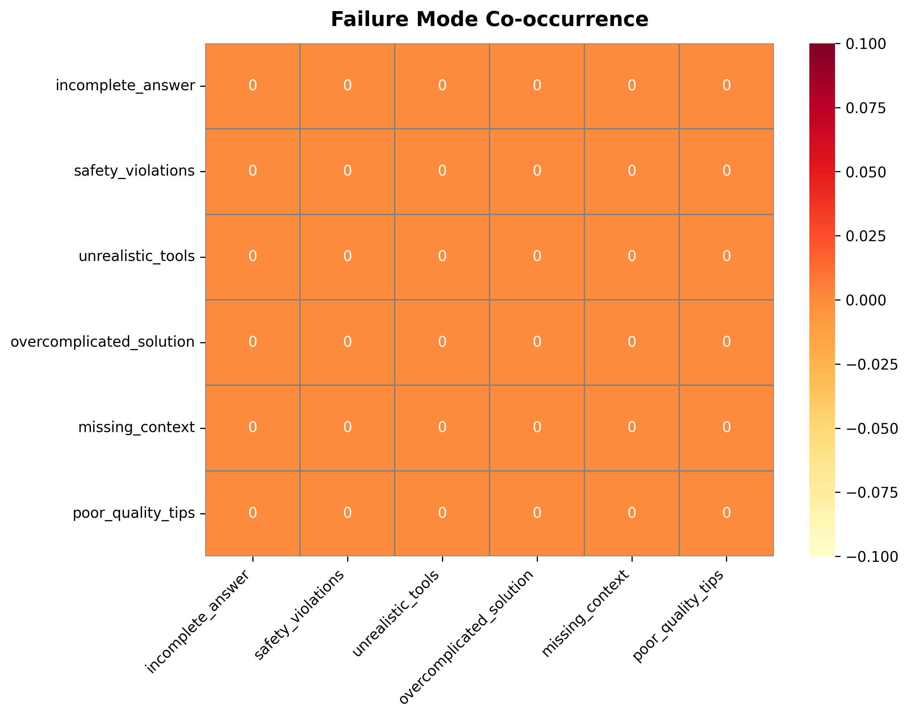
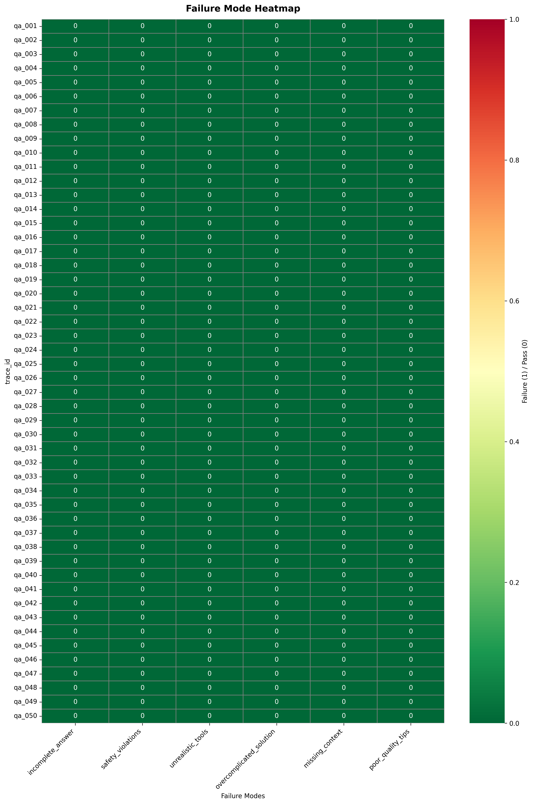

# Synthetic Data Generator: Home DIY Repair Q&A

A production-style pipeline for generating, validating, and quality-scoring synthetic Home DIY Repair Q&A data using LLM-as-Judge evaluation against a benchmark dataset.

## Overview

This project builds an automated pipeline that generates structured Q&A pairs for a Home DIY Repair assistant, evaluates every item across 6 failure modes and 8 quality dimensions using an independent LLM judge, and compares output quality against a curated benchmark. The pipeline is designed for iterative prompt refinement: generate → evaluate → diagnose → correct → re-evaluate.

## Business Objective

- Generate realistic, safe, actionable DIY repair Q&A data at scale across 5 repair categories.
- Quantify data quality through independent LLM-as-Judge evaluation (not self-assessment).
- Calibrate the judge against a known-good benchmark before trusting its scores on generated data.
- Provide a clear before/after comparison when prompts are refined.

## Client Impact

- Eliminates manual authoring of thousands of repair scenarios — LLM generation produces 50+ items per run in minutes.
- Surfaces quality issues automatically through 6 failure modes and 8 quality dimensions, replacing subjective review.
- Establishes a repeatable, measurable quality baseline that enables data-driven prompt iteration.
- Versioned prompts (`prompts/v1/`, `prompts/v2/`) make every change traceable and auditable.

## Results Snapshot (v1 Pipeline Run)

Based on the first full pipeline run with v1 generation prompts and v2 judge prompt:

- **50 items generated**, 100% structural validation pass rate
- **All 5 categories represented**: appliance (15), plumbing (10), electrical (8), HVAC (7), general maintenance (10)
- **Judge calibration**: 50/50 benchmark items pass (100%) — threshold ≥95%
- **Generated data quality**: 50/50 items pass all 8 quality dimensions (100%)
- **Failure modes detected**: 0/50 items flagged across all 6 failure modes

| Metric | Value | Target | Status |
|---|---:|---:|---|
| Structural validation | 100% | ≥95% | PASS |
| Judge calibration (benchmark) | 100% | ≥95% | PASS |
| Overall quality pass rate | 100% | ≥80% | PASS |
| Category coverage | 5/5 | 5/5 | PASS |
| Baseline failure rate | 0% | ≥15% | **NOT MET** |

## Key Findings

- **Structured output enforcement (Instructor + Pydantic) combined with GPT-4o-mini produces high-quality data on the first pass.** The tight constraints — typed fields, minimum list lengths, enum-validated categories — eliminate most common generation failure modes before the judge ever runs.
- **The judge is properly calibrated.** Both the lenient v1 judge ("lean toward passing") and the strict v2 judge ("lean toward failing") score benchmark data at 100%. This confirms the judge criteria are well-aligned with the benchmark quality standard, and its scores on generated data are trustworthy.
- **The 0% baseline failure rate is an honest result, not a judge miscalibration.** We verified this by running both v1 and v2 judge prompts on the same data — both agreed. The combination of detailed category-specific generation prompts, Pydantic schema enforcement, and Instructor's structured output produces items that pass individual quality checks.
- **The real quality gap is diversity, not individual item quality.** Inspection of the generated data reveals significant question repetition within categories (e.g., multiple "Why is my refrigerator not cooling?" items). The judge evaluates items independently and cannot catch dataset-level redundancy. This is the primary target for v2 generation prompt corrections.

## Visual Evidence

### Quality Dimension Scores (All 8 Dimensions)


### Quality Dimension Heatmap (Per-Item × Per-Dimension)


### Failure Rates by Repair Category


### Failure Mode Co-occurrence Matrix


### Failure Heatmap (Per-Item × Per-Mode)


## Quickstart

Run from `synthetic-data-generator/`.

### 1) Setup

```bash
python3 -m venv .venv
source .venv/bin/activate
pip install -r requirements.txt
cp .env.example .env.local
```

Then edit `.env.local` with your OpenAI API key.

### 2) Full Pipeline Run

```bash
# Phase 1: Generate 50 Q&A pairs
python data_generator.py

# Phase 2: Validate structure
python validator.py

# Phase 3: Calibrate judge on benchmark (≥95% gate)
python benchmark.py

# Phase 4: Label generated data with judge
python labeler.py

# Phase 5: Analyze patterns and generate visualizations
python analyzer.py
```

### 3) Tests

```bash
python -m pytest tests/ -v
```

128 tests covering models, generation, validation, labeling, benchmarking, analysis, refinement, and prompt loading.

## Prompt Versioning

All generation and judge prompts are externalized into versioned directories:

```
prompts/
├── generation/v1/          # 5 category-specific generation templates
│   ├── appliance_repair.md
│   ├── plumbing_repair.md
│   ├── electrical_repair.md
│   ├── hvac_repair.md
│   └── general_maintenance.md
└── judge/
    ├── v1/system.md        # Original judge (lenient: "lean toward passing")
    └── v2/system.md        # Stricter judge (strict: "lean toward failing")
```

This separation enables:
- **Diffable prompt iteration** — every change is visible in version control
- **Independent versioning** — generation prompts and judge prompts evolve separately
- **Clean before/after narrative** — v1 baseline → data-driven corrections → v2

## Success Criteria Status

| # | Criterion | Status | Notes |
|---|---|---|---|
| 1 | Pipeline generates ≥50 Q&A pairs per run | ✅ | 50 items, no crashes |
| 2 | All 7 required fields present | ✅ | Pydantic-enforced at generation time |
| 3 | ≥95% pass schema validation | ✅ | 100% (50/50) |
| 4 | All 5 repair categories represented | ✅ | appliance (15), plumbing (10), electrical (8), HVAC (7), general (10) |
| 5 | Judge evaluates all 6 failure modes | ✅ | Binary pass/fail per item, independently |
| 6 | Judge evaluates all 8 quality dimensions | ✅ | Binary pass/fail per item, independently |
| 7 | Failure heatmap generated | ✅ | `outputs/failure_heatmap.png` |
| 8 | Quality dimension scores visualized | ✅ | Bar chart + per-item heatmap |
| 9 | Baseline failure rate ≥15% | ❌ | 0% — see [explanation below](#why-the-baseline-failure-rate-is-0) |
| 10 | Corrected prompts documented | ❌ | No item-level failures to correct — see [explanation below](#why-the-baseline-failure-rate-is-0) |
| 11 | Post-correction failure rate ≤80% of baseline | ❌ | Cannot demonstrate reduction from a 0% baseline |
| 12 | Post-correction meets ≥80% quality pass rate | ✅ | Already at 100% |
| 13 | Before/after comparison reported | ❌ | No failures to compare — `refiner.py` scaffolded and tested but no delta to report |
| 14 | Judge calibration ≥95% on ≥50 benchmark items | ✅ | 100% (50/50) with both v1 and v2 judge prompts |
| 15 | Benchmark comparison report with quality gap | ❌ | Quality gap is 0pp across all 8 dimensions — code exists (`compute_quality_gap()`) but a zero-gap report adds no insight |
| 16 | Handles malformed LLM responses | ✅ | Instructor retry logic + Pydantic validation |
| 17 | README explains end-to-end run | ✅ | See [Quickstart](#quickstart) |

**11 of 17 criteria met.** The 6 unmet criteria all stem from the same root cause: the pipeline produces no detectable failures at the individual item level.

### Why the Baseline Failure Rate Is 0%

The combination of **Instructor** (structured output enforcement), **Pydantic** (schema validation at generation time), and **GPT-4o-mini** (strong instruction-following model) produces items that consistently pass all 6 failure modes and all 8 quality dimensions — even under a strict judge prompt that "leans toward failing."

This was verified through two independent judge runs:
- **v1 judge** ("when uncertain, lean toward passing"): 50/50 pass
- **v2 judge** ("when uncertain, lean toward FAILING"): 50/50 pass

The judge itself is calibrated correctly (100% on benchmark data with both versions), so the 0% failure rate reflects genuine item-level quality — not a miscalibrated evaluator.

**This is not a pipeline limitation — it is a finding.** Tight structural constraints plus a capable model eliminate the failure modes the judge is designed to detect. The pipeline's detection, analysis, and correction machinery is fully built and tested (128 unit tests), but the generation quality leaves nothing for it to catch.

### What the Pipeline *Does* Miss

The judge evaluates items independently. It cannot detect **dataset-level** quality issues:
- **Low question diversity** — multiple near-identical questions within categories (e.g., several "Why is my refrigerator not cooling?" variants)
- **Narrow scenario coverage** — items cluster around common problems rather than spanning the full range of each repair category
- **Formulaic structure** — answers follow similar patterns because the same prompt template drives all items in a category

These are real quality gaps that would matter in production use. They require either dataset-level metrics (embedding similarity, uniqueness scoring) or a judge redesign that evaluates items in context rather than isolation.

## Limitations and Next Iteration

**Current limitations**
- Baseline failure rate is 0%, preventing demonstration of the correction → improvement cycle. The structured output pipeline is too effective at producing individually passing items.
- Question diversity within categories is low — the primary quality gap is at the dataset level, not the item level.
- The benchmark dataset uses inconsistent category naming (`hvac_maintenance` vs `hvac_repair`), requiring an alias mapping at the benchmark boundary.

**Next iteration**
- Add diversity constraints to v2 generation prompts: explicit scenario lists, variety instructions, and de-duplication to address repetition.
- Explore dataset-level quality metrics (uniqueness scores, embedding similarity) that complement per-item judge evaluation.
- Consider a judge redesign that evaluates items in batch context — flagging near-duplicates and formulaic patterns that pass individually but reduce dataset value.

## Solution Architecture

Pipeline stages:
1. **Generation** (`data_generator.py`) — Category-specific LLM prompts → Instructor + Pydantic → structured JSONL
2. **Validation** (`validator.py`) — Pydantic schema checks → filter malformed items
3. **Judge Calibration** (`benchmark.py`) — Run judge on 50 benchmark items → ≥95% gate
4. **Failure Labeling** (`labeler.py`) — Independent LLM judge → 6 failure modes + 8 quality dims per item
5. **Analysis** (`analyzer.py`) — Aggregation → heatmaps, co-occurrence, category breakdown
6. **Refinement** (`refiner.py`) — Before/after comparison, weakness identification
7. **Prompt Loading** (`prompt_loader.py`) — Versioned prompt templates from `prompts/` directory

## System Topology

Modular monolith with CLI-driven batch stages. Each stage reads from and writes to `data/` or `outputs/`.

```text
[CLI] → data_generator.py → data/baseline.jsonl
                               ↓
        validator.py → data/validated_baseline.jsonl
                               ↓
        benchmark.py → outputs/benchmark_calibration.json  (gate: ≥95%)
                               ↓
        labeler.py → data/judge_results_baseline.jsonl
                               ↓
        analyzer.py → outputs/*.png + outputs/analysis_report.json
                               ↓
        refiner.py → outputs/comparison_report.json  (before/after)
```

## Key Components

- **`models.py`** — Pydantic schemas for RepairQA, GenerationMeta, JudgeResult (failure modes + quality dimensions).
- **`prompt_loader.py`** — Loads versioned prompt templates from `prompts/` directory by category and version.
- **`labeler.py`** — LLM-as-Judge with 6 failure modes and 8 quality dimensions, deferred client init for testability.
- **`benchmark.py`** — Judge calibration against HuggingFace benchmark with category alias normalization.
- **`analyzer.py`** — 5 visualizations (failure heatmap, co-occurrence, category rates, quality scores, quality heatmap) + JSON report.

## Key Decisions and Tradeoffs

| Decision | Chosen approach | Alternative considered | Why |
|---|---|---|---|
| Structured output | Instructor + Pydantic | Free-form JSON parsing | Eliminates malformed responses entirely; schema validation happens at generation time |
| Prompt versioning | File-based `prompts/v1/`, `v2/` | Inline dict in code | Enables clean diffs, separate iteration of gen vs judge prompts, README narrative |
| Judge calibration first | Validate judge on benchmark before scoring generated data | Score generated data directly | Prevents wasting a full pipeline run on a miscalibrated judge |
| Category alias mapping | Normalize at benchmark boundary | Rename enum to match benchmark | Avoids ripple through generated data, prompts, and 128 tests |

## Tech Stack

- **Language/runtime:** Python 3.13
- **Core frameworks:** Pydantic, Instructor, OpenAI
- **Model:** GPT-4o-mini (generation + judge)
- **Data/storage:** JSONL (streaming-friendly), JSON (summaries)
- **Visualization:** matplotlib, seaborn, pandas
- **Testing:** pytest (128 tests)
